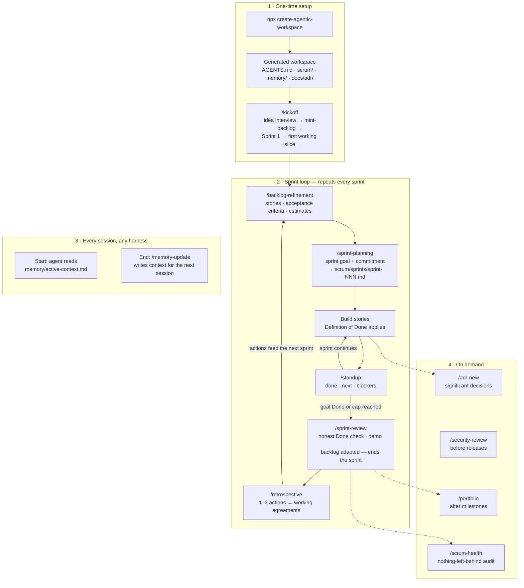

# create-agentic-workspace

## TL;DR

One command turns an empty folder into a project that AI coding agents know how to work
on:

```bash
npx github:vincentheimann/create-agentic-workspace my-project
```

The generated workspace gives any agent — Claude Code, OpenCode, Cursor, Windsurf,
Google Antigravity, anything that reads `AGENTS.md` — a shared rulebook and process:
a **Scrum loop** run through slash commands, a **persistent memory** so every session
continues where the last one stopped (even across different tools and models), **decision
records** (ADRs), a **security checklist**, a **portfolio generator**, and optional
**context optimizers**. You describe your idea and stay the Product Owner; the agent
plans, builds and keeps the paperwork honest. Start with `/kickoff` — you'll see the
first piece of your idea running in the same session.

Prefer pictures? [docs/HOW-IT-WORKS.md](docs/HOW-IT-WORKS.md) shows the three loop
layers (governance · sprint · session) and the common user path from idea to steady
rhythm.

---

Scaffold a complete, **harness-agnostic agentic workspace** into any new project — works
with Claude Code (Fable 5), OpenCode (Kimi K3 or any model), and every
AGENTS.md-compatible tool.

**New to AI coding agents?** Everything here is beginner-friendly: the scaffolder asks
plain questions, and the generated project includes a `GETTING-STARTED.md` written for
humans who have never used an agent before.

## Kickstart prompt (copy/paste into your agent chat)

Already inside an agent chat (Claude Code, OpenCode, …)? Paste this and the agent sets
everything up for you:

```text
I want to start a new project using the agentic workspace kit from
https://github.com/vincentheimann/create-agentic-workspace.

1. Interview me briefly (one question at a time): project name, one-line description,
   main language/stack, which harnesses I use (claude and/or opencode), sprint cadence
   (goal = sprint ends when its goal is Done, capped at 1-4 weeks — the default;
   session = one working session per sprint; calendar = classic fixed 1-4 weeks),
   solo or team, which modules I want (memory, adr, scrum, security,
   portfolio — default: all; plus release = release-please automation, default off,
   only useful if the project will live on GitHub) and which context optimizers
   (headroom, ponytail, graphify — default: all). Suggest sensible defaults so I can
   just say "yes".

2. Scaffold it with ONE non-interactive command (do NOT run the bare interactive
   wizard — it will hang in your shell). Fill in my answers:

   npx github:vincentheimann/create-agentic-workspace <dir> --name="…" \
     --description="…" --stack="…" --harnesses=claude,opencode \
     --sprint-cadence=goal --sprint-weeks=2 --team=solo \
     --modules=memory,adr,scrum,security,portfolio \
     --optimizers=headroom,ponytail,graphify

   (Use --optimizers=none / --modules=<subset> if I asked for less. Node >= 18.17 and
   git are required — check them first and tell me if something is missing.)

3. Read the generated AGENTS.md and GETTING-STARTED.md.

4. Then run the kickoff: follow .agents/skills/kickoff.md — interview me about my idea,
   seed a small backlog, plan Sprint 1, and BUILD the first working slice in this same
   session so I can see my idea running. (Freshly generated slash commands may need a
   harness restart; using the skill file directly always works.)
```

The rest of this README explains what you get and how to run it by hand.

One interactive command gives you:

- **`/kickoff`** — one command from empty project to first working feature: the agent
  interviews you, seeds the backlog, plans Sprint 1 and builds the smallest end-to-end
  slice of your idea in the same session.
- **`AGENTS.md` as single source of truth** — harness files (`CLAUDE.md`,
  `.claude/commands/`, `.opencode/command/`) are generated mirrors of `.agents/skills/`.
- **Scrum loops with ceremonies** as slash commands: `/backlog-refinement`,
  `/sprint-planning`, `/standup`, `/sprint-review`, `/retrospective`, `/scrum-health` —
  plus product backlog, Definition of Done and per-sprint files in `scrum/`.
- **Living memory** (`memory/`) — project charter (mission, vision, success criteria —
  the compass every ceremony checks against), active context, decision log, progress —
  kept in sync with `/memory-update`, shared across sessions and harnesses.
- **ADRs** (`docs/adr/`, MADR-lite) via `/adr-new`.
- **Security baseline** (`security/SECURITY-BASELINE.md`) audited by `/security-review`.
- **Release automation** (optional, needs GitHub) —
  [release-please](https://github.com/googleapis/release-please) turns Conventional
  Commits into `CHANGELOG.md` + GitHub Releases via a reviewable release PR; `/release`
  guides cutting one (`docs/RELEASING.md` explains the flow).
- **Portfolio plugin** — vendors the [portfolio-agent](https://github.com/vincentheimann/portfolio-agent)
  so `/portfolio` builds an evidence-based `PORTFOLIO.md` case study.
- **Context optimizers** — guided setup (`/setup-optimizers`) for
  [Headroom](https://docs.headroomlabs.ai/docs) (context compression),
  [Ponytail](https://github.com/dietrichgebert/ponytail) (minimal-code discipline) and
  [Graphify](https://github.com/Graphify-Labs/graphify) (codebase knowledge graph).

## Where do I run this?

**Everything starts in a terminal** — the text window where you type commands. Never
opened one? Windows: press the Windows key, type `powershell`, Enter. macOS: press
Cmd+Space, type `terminal`, Enter. Every editor below also has one built in (usually
*View → Terminal*), which is the most convenient place: you scaffold and run the agent
right next to your code.

The generated workspace then works in all of these tools:

| Tool | What it is | How this workspace fits |
|---|---|---|
| **Claude Code** | Anthropic's agent CLI | First-class: reads `CLAUDE.md`/`AGENTS.md`, slash commands from `.claude/commands/`, portfolio subagent. Run `claude` in the project folder — in any terminal, or via its VS Code / JetBrains extensions. |
| **OpenCode** | Open-source agent CLI (Kimi K3, many models) | First-class: reads `AGENTS.md`, commands from `.opencode/command/`. Run `opencode` in the project folder. |
| **VS Code** | Editor | Open the project folder, then use Claude Code's VS Code extension or run either CLI in the integrated terminal. |
| **Cursor** | AI editor | Reads `AGENTS.md` natively, so the rules, Scrum protocol and memory work out of the box. No generated slash commands — open a file from `.agents/skills/` and paste its instructions into the chat. |
| **Windsurf** | AI editor | Same as Cursor: `AGENTS.md` is read natively; use `.agents/skills/` files as prompts. |
| **Google Antigravity** | Agent-first IDE | Reads `AGENTS.md` from the project root. Its workflows are markdown files invoked as `/name` — register the `.agents/skills/` files as workflows to get the ceremonies as slash commands. |
| **JetBrains IDEs** | IDE (IntelliJ, PyCharm, …) | Claude Code's JetBrains plugin, or either CLI in the built-in terminal. |

Anything else that understands `AGENTS.md` (Codex CLI, Gemini CLI, Aider, …) picks up
the rules and memory automatically; the `.agents/skills/` files always work as
copy/paste prompts even without slash-command support.

## Prerequisites

| Tool | Needed for | Install |
|---|---|---|
| **Node.js ≥ 18.17** | Running the scaffolder | https://nodejs.org (LTS) |
| **git** | The `npx github:` form and `git init` | https://git-scm.com |
| **A harness** (at least one) | Actually working with agents | Claude Code: `npm install -g @anthropic-ai/claude-code` · OpenCode: `npm install -g opencode-ai` |

Optional, only if you enable the matching optimizer:

- **Graphify** needs Python tooling (`uv` or `pipx`) — https://docs.astral.sh/uv/. You
  don't have to prepare it: the wizard detects a missing Python setup when you select
  Graphify and warns you, and `/setup-optimizers` offers to install `uv` later (with
  your consent, never automatically).
- **Headroom** and **Ponytail** are installed later, guided by `/setup-optimizers` inside
  the workspace. Nothing to prepare.

Check your versions: `node --version` and `git --version`.

## Quick start

```bash
# straight from GitHub (requires git installed)
npx github:vincentheimann/create-agentic-workspace my-project

# or from a local clone
git clone https://github.com/vincentheimann/create-agentic-workspace
node create-agentic-workspace/bin/cli.js my-project
```

The wizard asks about: project name & description, stack, target harnesses, sprint
cadence (what ends a sprint — the goal being Done, the working session, or the
calendar), team mode, modules, optimizers, and git init. **Press Enter to accept the
defaults** — the defaults produce a full workspace with everything enabled except
release automation, which is off by default because it needs a GitHub repository
(select the "Release automation" module, or pass `--modules=...,release`, to add it).

Then:

```bash
cd my-project
claude        # or: opencode
```

…then run **`/kickoff`** and describe your idea — you end the first session with a small
piece of it actually running. `GETTING-STARTED.md` in the generated project covers
everything else (harness setup, the step-by-step alternative, the command cheat sheet).

Flags for non-interactive use: `--yes` (all defaults), `--offline` (skip the
portfolio-agent download), `--no-git`, `--help`, `--version`. Every wizard answer also
exists as a flag (`--name`, `--description`, `--stack`, `--harnesses`,
`--sprint-cadence`, `--sprint-weeks`, `--team`, `--modules`, `--optimizers`) — passing any of them skips the wizard, which is
how an AI agent scaffolds on your behalf (see the kickstart prompt above). Run `--help`
for the accepted values.

## Generated workspace layout

```
my-project/
├── AGENTS.md                  # single source of truth for all agents
├── GETTING-STARTED.md         # human-facing guide to the workspace
├── CLAUDE.md                  # thin Claude Code entrypoint (imports AGENTS.md)
├── .agents/
│   ├── skills/                # skill sources (edit here, then re-copy to mirrors)
│   └── portfolio-agent.md     # vendored portfolio agent definition
├── .claude/commands/          # mirror for Claude Code   (if selected)
├── .claude/agents/portfolio.md
├── .opencode/command/         # mirror for OpenCode      (if selected)
├── memory/                    # living memory (charter, active context, decisions, progress)
├── docs/adr/                  # architecture decision records
├── scrum/                     # backlog, DoD, sprints/, working agreements
├── security/SECURITY-BASELINE.md
├── optimizers/OPTIMIZERS.md   # chosen optimizers + real install commands
├── .github/workflows/release-please.yml   # release automation   (if selected)
├── release-please-config.json             # release-please setup (if selected)
└── docs/RELEASING.md                      # how releases work    (if selected)
```

## Running the Scrum loop

How a project iterates with this workspace, from empty folder to shipping loop:



Reading it top to bottom: setup happens once, the sprint loop repeats for the life of
the project, and the memory habit (box 3) is what lets you stop anytime and resume in a
different session — or a different tool — without losing the thread.

For the deeper picture — how the governance (charter), sprint and session loops nest
into each other, and the typical user journey from idea to steady rhythm — see
[docs/HOW-IT-WORKS.md](docs/HOW-IT-WORKS.md).

Two roles: **you are the Product Owner** (you decide what's valuable and what's
accepted), the **agent facilitates and develops** (it runs the ceremonies, writes the
artifacts, implements stories — and never invents your priorities). Every ceremony is a
slash command you type inside your harness; the agent does the bookkeeping.

| Ceremony | You | The agent | Files it touches |
|---|---|---|---|
| `/backlog-refinement` | Brain-dump ideas, answer questions, confirm the order | Turns ideas into user stories with acceptance criteria and estimates, splits big ones | `scrum/PRODUCT-BACKLOG.md` |
| `/sprint-planning` | Confirm/adjust the proposed sprint goal | Selects refined stories that fit the sprint, creates the sprint file | `scrum/sprints/sprint-NNN.md`, backlog statuses |
| `/standup` | Read 3 bullets, unblock if needed | Checks git log + story status, logs done / next / blockers | Standup log in the sprint file |
| `/sprint-review` | Follow the demo, accept or reject stories, give feedback | Verifies each story honestly against the Definition of Done, runs tests, adapts the backlog | Sprint file (Review), backlog, `memory/progress.md` |
| `/retrospective` | Discuss what to keep/change, approve 1–3 actions | Checks last retro's actions, records new ones, updates working agreements | Sprint file (Retro), `scrum/README.md`, `memory/decision-log.md` |
| `/scrum-health` | Read the health report, decide on substantive fixes | Audits sprint/backlog/memory consistency with evidence, fixes trivial bookkeeping, reports the rest | Sprint file, backlog, `memory/` (bookkeeping fixes only) |

On a brand-new project, `/kickoff` compresses the first pass of this loop into one
guided session that ends with the smallest slice of your idea running. After that — or
if you prefer the full ceremony from day one — a first sprint, concretely:

1. **`/backlog-refinement`** — tell the agent what you want to build, in plain words.
   It writes ordered, estimated stories into `scrum/PRODUCT-BACKLOG.md` and asks you to
   confirm the priorities.
2. **`/sprint-planning`** — the agent proposes a one-sentence sprint goal from the top of
   the backlog. You agree (or change it); it creates `scrum/sprints/sprint-001.md` with
   the committed stories.
3. **Work** — ask the agent to implement the first story. "Done" is defined by
   `scrum/DEFINITION-OF-DONE.md` (tests pass, no secrets, memory updated, …) — not by
   the agent's optimism.
4. **`/standup`** — once per working session (at least daily when work spans days).
   Three bullets, sprint file updated, risks surfaced early.
5. **`/sprint-review`** when the sprint goal is Done (or the cadence cap is reached) —
   the agent demos what's genuinely Done, moves unfinished work back to the backlog,
   and updates `memory/progress.md`. Running the review is what ends the sprint.
6. **`/retrospective`** — agree on 1–3 improvement actions; they're carried into the
   next sprint automatically because `/sprint-planning` reads them.
7. Loop back to step 1 (or straight to planning if the backlog is still refined).

Sprint boundaries are ceremonies, not dates: a sprint starts at `/sprint-planning` and
ends at `/sprint-review`, so with AI agents a sprint can compress into a single evening —
the weeks number you choose at scaffold time is only the latest point to hold the review
(or, in calendar cadence, a fixed length). The same walkthrough ships inside every
generated workspace as `GETTING-STARTED.md`, so you don't need this README open while
working. And because ceremonies are plain markdown skills, they run identically in any
harness that supports commands — or can be followed manually in one that doesn't.

## FAQ

**Do I need both Claude Code and OpenCode?**
No — pick whichever you have in the wizard's harness question. `AGENTS.md` works with
any compliant tool, so you can add a harness later.

**Can I run this on an existing project?**
Yes. The scaffolder never overwrites existing files (it lists what it kept untouched),
and it refuses to run at all if the project already has an `AGENTS.md`. Review the
generated `.gitignore` note in the output if your project already had one.

**Which model do I need?**
Any capable coding model. The workspace is tested with Claude (Fable 5 / Opus) via
Claude Code and Kimi K3 via OpenCode; nothing in it is model-specific.

**Are the optimizers required?**
No — they're all optional and can be skipped in the wizard or installed later with
`/setup-optimizers`.

**I don't have Python — can I still pick Graphify?**
Yes. The wizard warns you that Python tooling is missing and lets you keep or drop the
selection. If you keep it, `/setup-optimizers` walks you through installing `uv`
(Windows: `winget install --id=astral-sh.uv -e`, macOS/Linux: the official install
script) before installing Graphify. The scaffolder itself never installs Python — that
choice stays yours.

## Troubleshooting

- **`npx github:… ` fails immediately** — you probably don't have git installed (npx
  needs it to fetch from GitHub), or a corporate proxy blocks GitHub. Clone manually and
  run `node bin/cli.js` instead.
- **"needs Node.js >= 18.17"** — update Node from https://nodejs.org.
- **"Could not fetch the portfolio agent"** — you were offline or GitHub was
  unreachable; the scaffolder wrote a placeholder at `.agents/portfolio-agent.md` with
  the URL to fetch manually. Everything else works normally.
- **Slash command not found in the harness** — commands live in `.claude/commands/`
  (Claude Code) or `.opencode/command/` (OpenCode); restart the harness after
  scaffolding, or check that you selected that harness in the wizard.
- **`graphify: command not found` after install** — run `uv tool update-shell` (uv) or
  `pipx ensurepath`, then open a new terminal.

## Extending

- **Add a skill:** drop a markdown file (frontmatter `description:` + instructions) into
  `template/skills/`, register it in the `SKILLS` map in `bin/cli.js`.
- **Add a module:** add its files to `template/`, register paths in the `FILES` map, and
  wrap any `AGENTS.md` additions in `<!-- BEGIN:yourmodule --> … <!-- END:yourmodule -->`.
- Conditional content anywhere in templates uses the same BEGIN/END markers; `{{VARS}}`
  are substituted at scaffold time.

## Development

Zero runtime dependencies (Node ≥ 18.17). Run the smoke test:

```bash
npm test
```

## License

MIT
