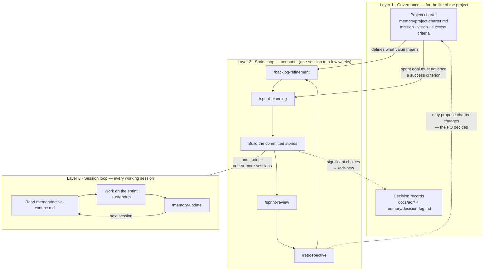
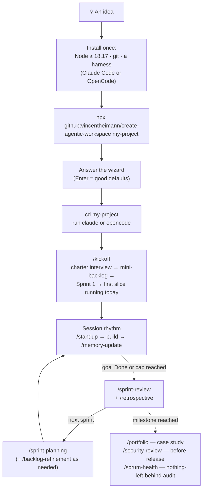

# How it works

Two pictures: the **three nested loops** the workspace runs on, and the **common user
path** from idea to steady rhythm.

## The loop layers

The workspace is three loops running at different speeds, each nested in the one above.
The slower a layer, the harder it should be to change it.

- **Layer 1 — Governance** moves at the speed of the project. The charter is the
  compass: refinement uses it to judge value, planning must say which success criterion
  a sprint goal advances, and ADRs that touch direction cite it. It changes only by
  explicit Product Owner decision — usually because a retrospective surfaced a reason.
- **Layer 2 — Sprint loop** moves at the speed of the work, not the calendar: a sprint
  starts at `/sprint-planning` and ends at `/sprint-review` — with AI agents that can be
  a single intense session or a few weeks (the cadence chosen at scaffold time says when
  the review is due). It turns the charter into ordered work and honest increments; the
  retrospective's actions feed the next turn of the loop.
- **Layer 3 — Session loop** moves in hours. It's what makes the whole thing survive
  interruptions: every session starts by reading the active context and ends by writing
  it, so any harness — or any model — can pick up where the last one stopped.

## The common user path

What using the kit actually looks like, end to end:

The two moments that matter most:

1. **The first session** ends with a piece of the idea actually running (`/kickoff`
   guarantees the first story is small enough for that).
2. **Every session after** starts in seconds, because the memory loop means nothing has
   to be re-explained — not to the same agent, and not to a different one.
