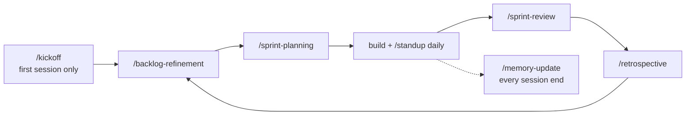

# Getting started — {{PROJECT_NAME}}

Welcome! This project was set up with an **agentic workspace**: a set of files that tell
AI coding agents how to work here — with a Scrum process, a persistent memory, and
decision records. This guide is for you, the human. You don't need any prior experience
with AI agents.

## 1. Install a harness (once)

A *harness* is the tool that runs the AI agent in your terminal. Install at least one:

<!-- BEGIN:harness-claude -->
**Claude Code** (Anthropic — runs Fable 5 / Opus):

```
npm install -g @anthropic-ai/claude-code
```

Then open a terminal **in this project folder** and run `claude`. The first run walks you
through logging in. Docs: https://code.claude.com/docs
<!-- END:harness-claude -->

<!-- BEGIN:harness-opencode -->
**OpenCode** (open source — runs Kimi K3 and many other models):

```
npm install -g opencode-ai
```

Then run `opencode` in this folder and pick your model/provider (you'll need an API key
for the model you choose). Docs: https://opencode.ai
<!-- END:harness-opencode -->

Both harnesses automatically read `AGENTS.md`, so the agent already knows the rules of
this workspace the moment it starts.

Tip: run these commands from a terminal *inside your editor* (VS Code, Cursor, JetBrains:
*View → Terminal*) so the agent works right next to your code. AI editors like Cursor,
Windsurf and Google Antigravity also read `AGENTS.md` natively — in those, use the files
in `.agents/skills/` as copy/paste prompts instead of slash commands (Antigravity can
register them as `/name` workflows).

## 2. Your first session (~15 minutes)

**The shortcut: run `/kickoff` and describe your idea.** It does everything below in one
guided flow — and ends with the first small piece of your idea actually running, today.

Prefer to go step by step? Type these as messages/commands inside the harness:

1. **Introduce the project.** Say: *"Interview me to fill in `memory/project-charter.md`"*
   — the agent asks about your mission, vision and success criteria and writes them
   down. This charter is the project's compass: every later ceremony checks against it.
<!-- BEGIN:optimizers -->
2. **Install the optimizers.** Run `/setup-optimizers` — the agent walks you through
   installing the context optimizers chosen for this workspace (see
   `optimizers/OPTIMIZERS.md`). You can skip this and do it later.
<!-- END:optimizers -->
<!-- BEGIN:scrum -->
3. **Build your backlog.** Run `/backlog-refinement` and brain-dump what you want to
   build. The agent turns it into ordered, estimated user stories.
4. **Start Sprint 1.** Run `/sprint-planning` — you agree on a sprint goal and the agent
   creates the sprint file.
5. **Work.** Ask the agent to implement the first story. Each day, `/standup` keeps the
   sprint log honest.
<!-- END:scrum -->
<!-- BEGIN:memory -->
6. **Before you stop:** run `/memory-update` so the next session (even in a different
   harness or model) picks up exactly where you left off.
<!-- END:memory -->

## 3. The loop at a glance



Setup and kickoff happen once; the loop repeats for the life of the project. The memory
update is what lets you stop anytime and resume later without losing the thread.

## 4. Command cheat sheet

| Command | What it does | When |
|---|---|---|
| `/kickoff` | Idea → backlog → Sprint 1 → first working slice, in one session | Once, on a fresh project |
<!-- BEGIN:scrum -->
| `/backlog-refinement` | Clarify, split, estimate and order backlog items | Whenever ideas pile up |
| `/sprint-planning` | Agree a sprint goal, commit stories, create the sprint file | Sprint start |
| `/standup` | 3-bullet daily check against the sprint goal | Daily |
| `/sprint-review` | Verify what's really Done, demo, adapt the backlog | Sprint end |
| `/retrospective` | Improve the way of working (1–3 concrete actions) | After review |
<!-- END:scrum -->
<!-- BEGIN:adr -->
| `/adr-new` | Record an architecture decision | When deciding something significant |
<!-- END:adr -->
<!-- BEGIN:memory -->
| `/memory-update` | Save session context to `memory/` | End of every session |
<!-- END:memory -->
<!-- BEGIN:security -->
| `/security-review` | Audit the repo against the security baseline | Before releases |
<!-- END:security -->
<!-- BEGIN:release -->
| `/release` | Review the release-please PR and cut a release (needs GitHub) | When you want to ship |
<!-- END:release -->
<!-- BEGIN:portfolio -->
| `/portfolio` | Build/refresh `PORTFOLIO.md`, an evidence-based case study | After milestones |
<!-- END:portfolio -->
<!-- BEGIN:optimizers -->
| `/setup-optimizers` | Install/verify the context optimizers | Once, at start |
<!-- END:optimizers -->

If your harness has no slash commands, open the matching file in `.agents/skills/` and
paste its instructions as a message.

## 5. Where things live

- `AGENTS.md` — the rulebook every agent follows (start here if curious)
<!-- BEGIN:memory -->
- `memory/` — what the agents remember between sessions
<!-- END:memory -->
<!-- BEGIN:scrum -->
- `scrum/` — backlog, Definition of Done, one file per sprint
<!-- END:scrum -->
<!-- BEGIN:adr -->
- `docs/adr/` — why things are the way they are
<!-- END:adr -->
<!-- BEGIN:security -->
- `security/` — the security baseline and review findings
<!-- END:security -->
<!-- BEGIN:release -->
- `docs/RELEASING.md` — how automated releases and release notes work
<!-- END:release -->
- `.agents/skills/` — the source of every command above (edit here, copy to
  `.claude/commands/` / `.opencode/command/`)

## 6. Good habits

- You are the **Product Owner**: agents propose, you decide. Never let an agent invent
  your priorities.
- Small sprints, honest reviews: "Done except…" is not Done
  (see `scrum/DEFINITION-OF-DONE.md`).
- End every session with `/memory-update`. It's the difference between an agent that
  remembers your project and one that starts from zero.
- **Ship in session one.** End your first session with something that runs, however
  small — momentum beats process. If you only remember one command: `/kickoff`.

You can delete this file once you no longer need it — nothing depends on it.
